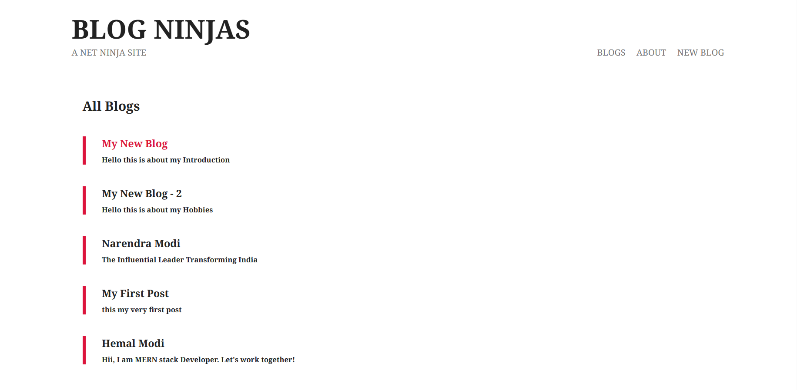
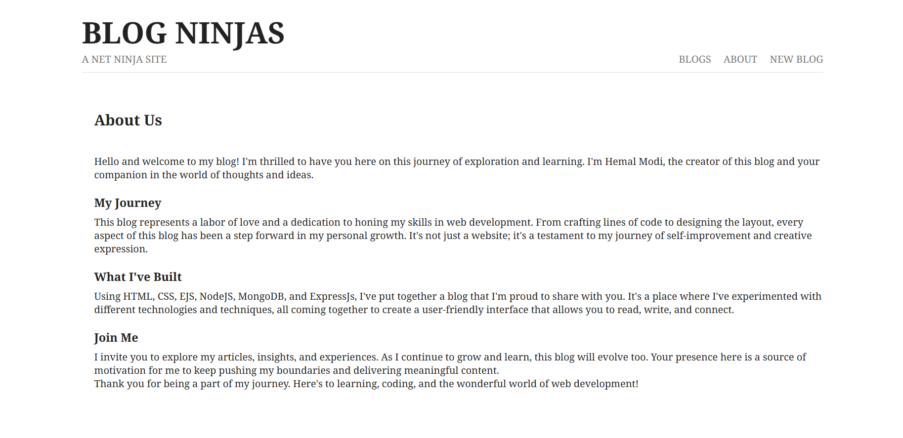
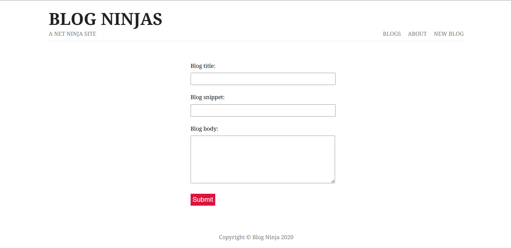
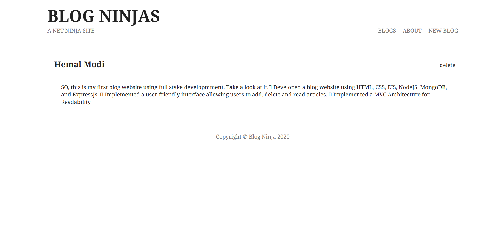

# My Blog Website

Welcome to my blog website! This is a personal practice project where I've developed a blog using HTML, CSS, EJS, NodeJS, MongoDB, and ExpressJs. The website follows an MVC architecture for improved readability and structure.

## Features

- User-friendly interface allowing users to:
  - Read articles
  - Add new articles
  - Delete articles
- MVC architecture for better organization

## Preview

### Home Page

### About Page

### Add New Blog Page

### Blog Page

## How to Run

1. Clone the repository: `git clone https://github.com/your-username/your-blog.git`
2. Navigate to the project directory: `cd your-blog`
3. Install dependencies: `npm install`
4. Install additional packages: 
   - Express: `npm install express`
   - Lodash: `npm install lodash`
   - Mongoose: `npm install mongoose`
   - Nodemon: `npm install nodemon`
   - EJS: `npm install ejs`
   - MongoDB: `npm install mongodb`

5. Start the server: `node serverLearn.js`
6. Open your browser and go to: `http://localhost:3002`

## Contributing

Contributions are welcome! If you find any issues or have ideas to improve this project, feel free to submit a pull request.